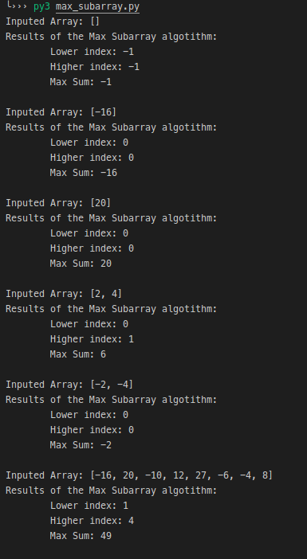
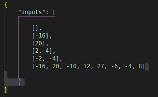

# Mestrado Computação Aplicada IPT - 2.2020

## Estrutura de Dados e Algoritmos - Prof Eduardo Takeo

    Exercício Programa 1

    Aluno: João Miguel Moreno Ferreira Lima

### Estrututra da Pasta

A pasta raiz _mestrado-ipt_ contém 4 arquivos:

* __readme__
* __max_subarray.py__
* __max_subarray_crossing_middle.py__
* __inputs.json__
  
#### __max_subarray.py__

Este arquivo contém a função principal do algoritmo. A partir desta função as chamadas recursivas ocorrerão e o resultado será retornado.

A imagem a seguir exemplifica como os resultados do algoritmo serão apresentados para cada array fornecido ao algoritmo. 

> _Inputed Array_ : é o vetor fornecido como entrada para o algoritmo

> _Lower Index_ : é o menor índice que fornece o resultado soma máxima para o vetor de entrada

> _Lower Index_ : é o maior índice que fornece o resultado soma máxima para o vetor de entrada

> _Max sum_ : é o valor da maior soma existente no vetor de entrada

É possível fornecer mais de um vetor de entrada nessa aplicação.

#### __max_subarray_crossing_middle.py__

Este arquivo contem a função que calcula o máximo subarray que cruza o meio do array e que será chamada pela função principal.

#### __inputs.json__

Este arquivo contém uma estrutura de dados _json_ para testar o algoritmo. Dentro dessa estrutura é possível instanciar mais de um vetor de entrada para o algoritmo de modo que quando o teste iniciar, ele executará o algoritmo para cada vetor de entrada instanciado no arquivo _json_. 

## Como executar

Entre na pasta raiz chamada __mestrado-ipt__ 

> $ cd mestrado-ipt

Em seguida execute o programa sem nenhum parâmetro

> python3 max_subarray.py

Os vetores de entrada do algoritmo são definidos no arquivo __inputs.json__. O resultado será exibido no terminal.