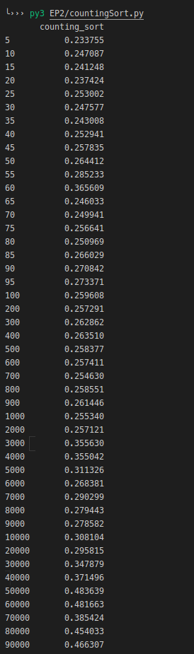
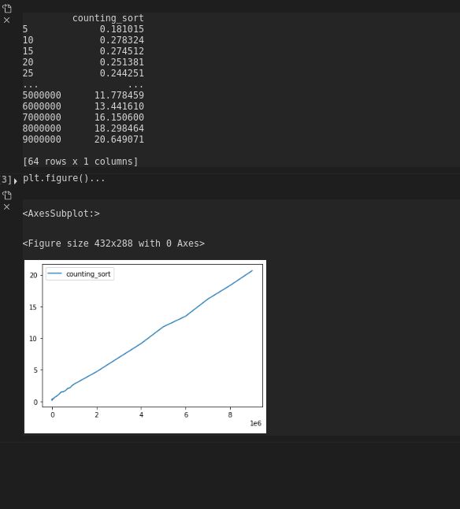
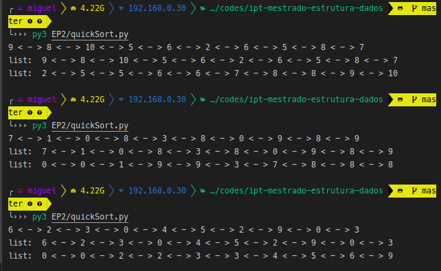

# Mestrado Computação Aplicada IPT - 2.2020

## Estrutura de Dados e Algoritmos - Prof Eduardo Takeo

    Exercício Programa 2

    Aluno: João Miguel Moreno Ferreira Lima

### Estrututra da Pasta

A pasta raiz _mestrado-ipt-ep2_ contém 3 arquivos:

* __readme__
* __linkedlist.py__
* __countingsort.py__
  
#### __linkedlist.py__

Este arquivo contém a implementação da LISTA CIRCULAR DUPLAMENTE LIGADA COM CABEÇA E COM CAUDA e suas funções mais importantes para adicionar elementos, remover, trocar nós de lugar, imprimir seu conteúdo, etc.

Além disso ela implementa de forma nativa a função de counting sort.

#### __countingsort.py__

Este arquivo implementa uma sequência de testes de ordenação usando apenas o counting sort como algoritmo de ordenação.

Aqui eu defino o tamanho das listas randomicas, indo de 5 para até 10.000.000 de elementos.

Sobre cada uma dessas listas randômicas é realziada a ordenação de seus elementos.

## Como executar

Entre na pasta raiz chamada __mestrado-ipt-EP2__ 

> $ cd mestrado-ipt-EP2

Em seguida instale as dependências (matplotlib e pandas data frames)

>$ pip install -r requirements.txt

Por fim, execute o programa sem nenhum parâmetro

>$  python3 countingSort.py 

Exemplos de saídas dadas pelo counting sort:

Executamos o counting sort para até 10.000.000 de entradas e seu gráfico TEMPO x N é o seguinte:

Você verá o data framde das N listas de entrada e seus respectivos tempos de ordenação.

> NOTA: TIVE PROBLEMAS COM A LÓGICA DO QUICK SORT POR USAR LISTA COM CABEÇA E COM CAUDA E, PORTANTO, NÃO CONSEGUI FINALIZÁ-LO CORRETAMENTE.

> FUNCIONA PARA MUITOS CASOS, PORÉM, EM ALGUMAS SITUAÇÕES A ORDENAÇÃO INICIAL DO VETOR GERA UMA QUEBRA DO CÓDIGO. ASSIM, PREFERI NÃO DIZER QUE FINALIZEI.

O algoritmo usado no quick Sort encontra-se em quickSort.py.
> É possível executá-lo separadamente e verificar que ele funciona para muitos casos. 

Basta executar o comando 

> $ python3 quickSort.py

Exemplo de resultados dados pelo quickSort quando funciona:

